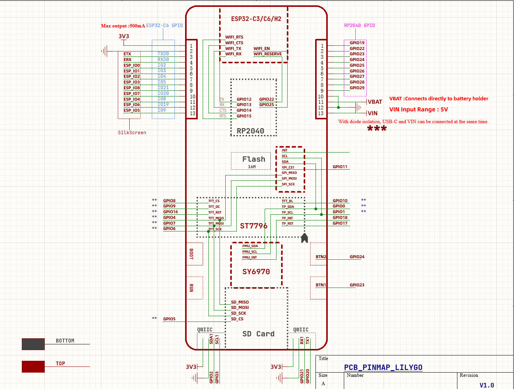

<h1 align = "center">🌟LilyGO Pico Pro🌟</h1> 

## 1️⃣Product

| Product        | Combination                                          | Resolution | Size          |
| -------------- | ---------------------------------------------------- | ---------- | ------------- |
| [T-PicoPro][1] | RP2040(264kB SRAM + 16MB Flash) + ESP32-C6(4M Flash) | 222x480    | IPS 2.33 Inch |

[1]: https://www.lilygo.cc/products/

## 2️⃣Examples

```txt
examples/
├── ATDebug                            # Serial AT debugging
├── AT_ESP_Gpio                        # RP2040 controls ESP32C6 GPIO
├── AdjustBacklight                    # Backlight adjustment example
├── Arduino_GFX_HelloWorld             # Arduino_GFX example
├── Arduino_GFX_HelloWorldGfxfont      # Arduino_GFX example
├── Arduino_GFX_ImgViewerAnimatedGIF   # Arduino_GFX example
├── Arduino_GFX_LvglBenchmark          # Arduino_GFX & lvgl example
├── Arduino_GFX_PDQgraphicstest        # Arduino_GFX example
├── CapacitiveTouch                    # Capacitive touch example
├── Factory                            # Factory hardware test example
├── LTR553ALS_Sensor                   # Lighting and Proximity Sensor Example
├── PMU                                # Onboard power management example
├── PWM                                # RP2040 PWM Example
├── QWIIC_GPS_Shield                   # QWIIC I2C Sensor Example
├── QWIIC_Sesnsor                      # QWIIC Uart GPS Module Example
├── SDCard                             # SD card read and write example
├── TFT_eSPI                           # TFT_eSPI example
├── TJpg_Decoder                       # TFT_eSPI & JPEG Decoder example
├── WiFi                               # WiFi usage example 
│   ├── ChatServer
│   ├── PagerServer
│   ├── ScanNetworksAdvanced
│   ├── UdpSendReceiveString
│   ├── UdpSender
│   ├── WebClient
│   ├── WebServer
│   └── WiFiSSLClient
└── esp32c6_pins                       # ESP32-C6 Arduino Core Test Pin Example
```

* For more examples of **RP2040**  chip functions, please refer to [arduino-pico-libraries](https://github.com/earlephilhower/arduino-pico/tree/master/libraries)
* For more examples of **ESP32-C6**  chip functions, please refer to [arduino-esp32-libraries](https://github.com/espressif/arduino-esp32/tree/master/libraries)
* **ESP32-C6** [AT command set](https://docs.espressif.com/projects/esp-at/en/latest/esp32c6/Get_Started/index.html)

## 3️⃣ Write to new users

* For first time use, you need to use [Zadig](https://zadig.akeo.ie/) to replace the driver to correctly identify the port.
* `T-PicoPro` uses a reversible Type-C design, which corresponds to the port of **RP2040** and the USB port of **ESP32-C6** respectively.
* How to identify the port of RP2040?
   - Press and hold the **BOOT** button on the side of the `T-PicoPro`, and then plug in the **USB-C**. If the computer recognizes it as a disk, then it is the port of the **RP2040**
* In addition to being a UART, the T-PicoPro `QWIIC` UART port can also be used as a normal IO
* The `QWIIC` I2C port cannot be used for other purposes and can only be configured as an I2C interface because it is connected to the screen touch and PMU.
* **ESP32-C6** uses **AT firmware** by default. You can find the custom compilation method of AT firmware [here](https://docs.espressif.com/projects/esp-at/en/latest/esp32c6/AT_Command_Set/Basic_AT_Commands.html).
* **ESP32-C6** default AT firmware is compiled in `V3.3.0-dev`. The firmware has been simply modified (GPIO control function added), the source code can be found [here](https://github.com/lewisxhe/esp-at),Please see [commit](https://github.com/lewisxhe/esp-at/commit/66f9f164584fbf6e01158b5fb5578f0fd495b498) for specific changes
* The **T-PicoPro** charging indicator light can be turned off through software. If the battery is not connected, the indicator light will flash.

## 4️⃣ PlatformIO Quick Start (Recommended)

1. Install [Visual Studio Code](https://code.visualstudio.com/) and [Python](https://www.python.org/)
2. Search for the `PlatformIO` plugin in the `VisualStudioCode` extension and install it.
3. After the installation is complete, you need to restart `VisualStudioCode`
4. After restarting `VisualStudioCode`, select `File` in the upper left corner of `VisualStudioCode` -> `Open Folder` -> select the `T-PicoPro` directory
5. Wait for the installation of third-party dependent libraries to complete
6. Click on the `platformio.ini` file, and in the `platformio` column
7. Uncomment one of the lines `src_dir = xxxx` to make sure only one line works
8. Click the (✔) symbol in the lower left corner to compile
9. Connect the board to the computer USB
10. Click (→) to upload firmware
11. Click (plug symbol) to monitor serial output
12. If it cannot be written, or the USB device keeps flashing, please check the **FAQ** below

## 5️⃣ Arduino IDE Quick Start

* It is recommended to use platformio without cumbersome steps

1. Install [Arduino IDE](https://www.arduino.cc/en/software)
2. Install [Arduino Pico](https://arduino-pico.readthedocs.io/en/latest/install.html)
3. Download or clone `T-PicoPro` to any location
4. Copy all folders in [lib folder](./lib/)  to Arduino library folder (e.g. C:\Users\YourName\Documents\Arduino\libraries)
5. Open ArduinoIDE  ,`Tools` , Look at the picture to choose
   
6. `T-PicoPro` folder -> `examples` -> `Any Examples`
7. Select `Port`
8. Click `upload` , Wait for compilation and writing to complete
9. If it cannot be written, or the USB device keeps flashing, please check the **FAQ** below

# 6️⃣  FAQ

1. If writing fails successfully,
   1. Connect the board via the USB cable
   2. Press and hold the (on the side)BOOT button , While still pressing the (on the side)BOOT button, press (on the side)RST
   3. Release the (on the side)RST
   4. Release the (on the side)BOOT button
   5. Upload sketch

2. How to write ESP32-C6?
   1. Since the `ESP32-C6` reset pin is controlled by `RP2040`, when you need to update the `ESP32-C6` firmware, please do not include the operation of controlling the `ESP32-C6` reset pin in the program in `RP2040`.
   2. Press and hold the `BOOT` button near the bottom of the `ESP32-C6` module, and then plug in the USB-C. Please make sure you are plugging in the USB port side of the `ESP32-C6`. The computer should be able to write to the `ESP32-C6` normally.

3. How do I check if the hardware is OK?
   1. Please follow the first step of the **FAQ** and drag `firmware.uf2` in the firmware directory into the disk. The program includes hardware self-test, which can determine whether the hardware is normal.

# 7️⃣ PinMap



# 7️⃣ Resource

* [Light Sensor datasheet](https://github.com/lewisxhe/SensorLib/blob/master/datasheet/LTR-553ALS-01.pdf)
* [RP2040](https://www.raspberrypi.com/documentation/microcontrollers/rp2040.html)
* [ST7796S](http://www.lcdwiki.com/res/MSP4021/ST7796S-Sitronix.pdf)
* [CST226SE](https://github.com/lewisxhe/SensorLib/blob/master/datasheet/%E6%B5%B7%E6%A0%8E%E5%88%9B%E8%A7%A6%E6%91%B8%E8%8A%AF%E7%89%87%E7%A7%BB%E6%A4%8D%E6%89%8B%E5%86%8C-v3.5-20220701(1).pdf)
* [SY6970](./datasheet/AN_SY6970.pdf)

# 8️⃣ Depends on required libraries

* [lvgl 8.3.9](https://github.com/lvgl/lvgl)
* [AceButton](https://github.com/bxparks/AceButton)
* [TFT_eSPI](https://github.com/Bodmer/TFT_eSPI)
* [Arduino_GFX](https://github.com/moononournation/Arduino_GFX)
* [WiFiEspAT](https://github.com/jandrassy/WiFiEspAT)
* [XPowersLib](https://github.com/lewisxhe/XPowersLib)
* [SensorLib](https://github.com/lewisxhe/SensorsLib)
* [MPU9250](https://github.com/bolderflight/MPU9250)
* [Adafruit_BME280_Library](https://github.com/adafruit/Adafruit_BME280_Library)
* [TinyGPSPlus](https://github.com/mikalhart/TinyGPSPlus)
